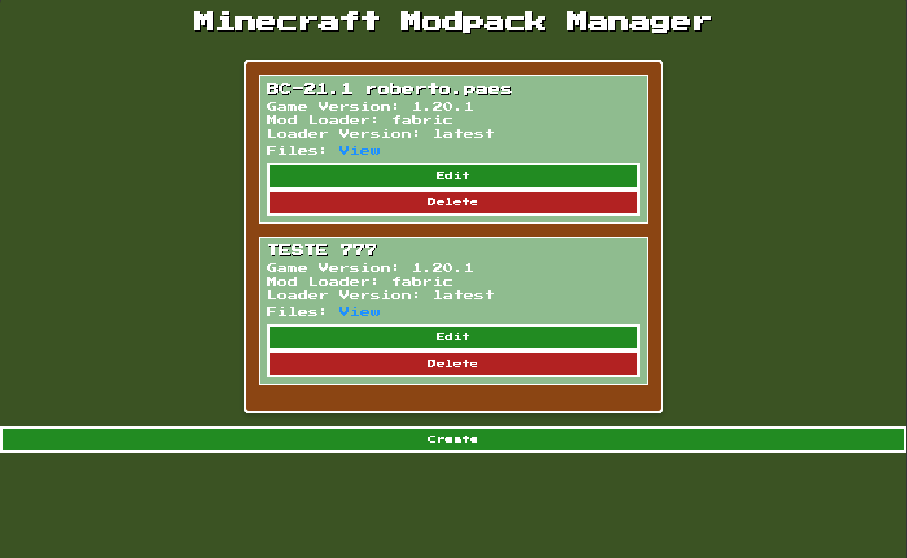
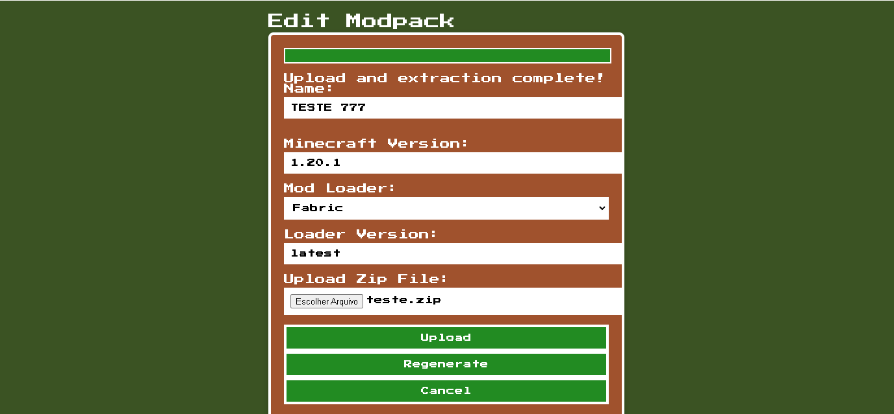

# Minecraft Modpack Manager

A Minecraft-inspired modpack manager API designed to work with [BertobrLauncher](https://github.com/brutalzinn/bertobrlauncher), a custom Minecraft launcher.
This is a simple PHP old style monolith to use at my hostgator web host. The objective is sync the files between the clients


## Table of Contents
- [Minecraft Modpack Manager](#minecraft-modpack-manager)
  - [Table of Contents](#table-of-contents)
  - [Introduction](#introduction)
  - [Prerequisites](#prerequisites)
  - [Setup](#setup)
  - [Running the Project](#running-the-project)
  - [Screens](#screens)

## Introduction

This project is a modpack manager API for Minecraft, designed to be used with [bobertobrLauncher](https://github.com/brutalzinn/bertobrlauncher). It allows you to create, manage, and version modpacks through a web interface.

You need to config a token to access this panel at app/config.php

## Prerequisites

To run this project, you need to have Docker and Docker Compose installed on your machine or you can use xamp and clone this project inside your htdocs.
   
## Setup

1. **Clone the repository**:
    ```bash
    git clone https://github.com/your-username/minecraft-modpack-manager.git
    cd minecraft-modpack-manager
    ```

2. Configure your token to access the painel inside app/config.php

## Running the Project

To start the project using Docker Compose, follow these steps:

1. **Build and run the Docker containers**:
    ```bash
    docker-compose up --build
    ```

    This command will build the Docker images and start the containers defined in the `docker-compose.yml` file.

2. **Access the API**:

    Once the containers are up and running, you can access the API by navigating to [http://localhost:3000?token=yourtoken](http://localhost:3000?token=yourtoken) in your web browser.

## Screens 

1. 
2. 


